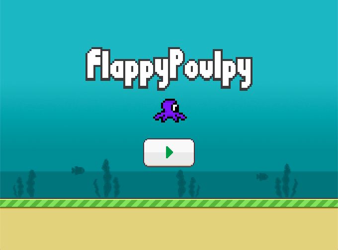
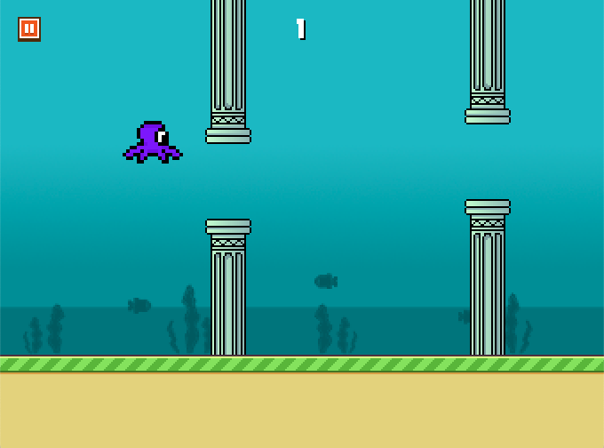

# FlappyPoulpy

This is an adapted implementation of [Godot Engine Tutorial - Flappy Bird](https://bitbucket.org/EdwardAngeles/godot-engine-tutorial-flappy-bird) in godot 3.3 for ORTHOPUS' MyoCoach v2.x integration.

## Notice
A part of the assets in this game are taken from original tutorials and Author did not mention the license. If the auther or copyright holder would like for the assets to be removed, please open an issue.

## Credits
Some other assets were designed specifically for this adaptation : 
* the game background was designed by [@Mona-ORTHOPUS](https://github.com/Mona-ORTHOPUS)
* the name of the game was suggested by [@Orthopus-Captain](https://github.com/Orthopus-Captain)

## License
Source code is provided under [MIT](https://choosealicense.com/licenses/mit/)

##Screenshots

Menu

Game Level

